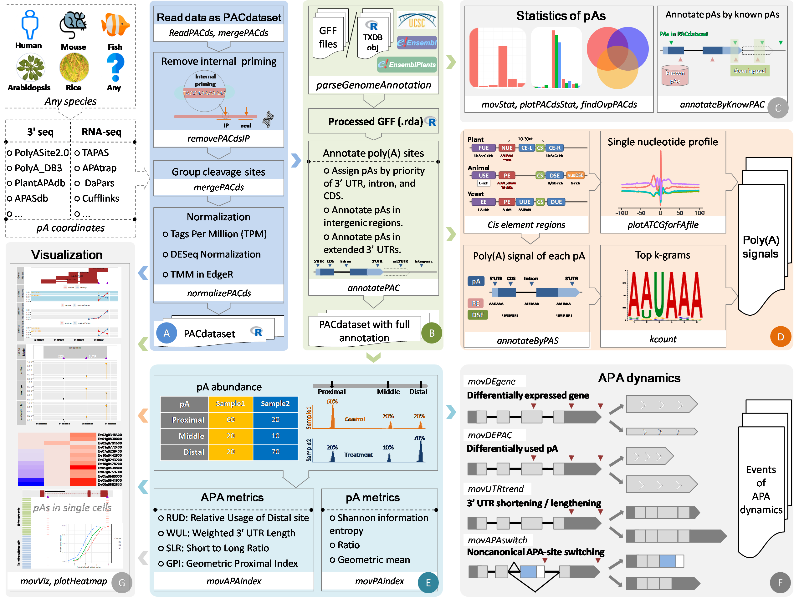

# movAPA
**Mo**deling and **v**isualization of dynamics of **a**lternative **p**oly**a**denylation across biological samples

## About
Alternative polyadenylation (APA) has been widely recognized as a widespread mechanism modulated dynamically. Studies based on 3′ end sequencing and/or RNA-seq have profiled poly(A) sites in various species with diverse pipelines, yet no unified and easy-to-use toolkit is available for comprehensive APA analyses. We developed an R package called __movAPA__ for **mo**deling and **v**isualization of dynamics of **a**lternative **p**oly**a**denylation across biological samples. movAPA incorporates rich functions for preprocessing, annotation, and statistical analyses of poly(A) sites, identification of poly(A) signals, profiling of APA dynamics, and visualization. Particularly, seven metrics are provided for measuring the tissue-specificity or usages of APA sites across samples. Three methods are used for identifying 3′ UTR shortening/lengthening events between conditions. APA site switching involving non-3′ UTR polyadenylation can also be explored. Using poly(A) site data from rice and mouse sperm cells, we demonstrated the high scalability and flexibility of movAPA in profiling APA dynamics across tissues and single cells.

* The movAPA package consists of seven main modules.



(1) Poly(A) sites of biological samples obtained from 3’ seq or RNA-seq are stored in the PACdataset object and further preprocessed for the removal of internal priming artifacts and normalization.

(2) The genome annotation file in __GFF3/GTF__ format is processed, then poly(A) sites are annotated with rich information such as gene id, gene type, and genomic regions. 

(3) Statistical analyses can be conducted to profile the global landscape of poly(A) site distributions and count the overlap with other poly(A) site datasets. 

(4) Sequences surrounding poly(A) sites can be extracted and poly(A) signals of specific regions can be identified. 

(5) Three metrics can be adopted for the quantification of the usage of each poly(A) site across samples and four metrics are used for the quantification of dynamic APA site usage of a gene. 

(6) APA dynamics across biological samples can be profiled, including the detection of differentially expressed poly(A) sites and genes, 3′ UTR lengthening/shortening events, and canonical or non-canonical APA site switching events. 

(7) Rich functions are provided for the visualization of poly(A) site distributions and dynamic APA site usages across selected biological samples or single cells. 


## Getting started
### Mandatory
* R (>=3.5.0). [R 3.6.3](https://www.r-project.org/) is recommended.

### Required R Packages
* [dplyr](https://CRAN.R-project.org/package=dplyr), [reshape2](https://CRAN.R-project.org/package=reshape2), [IRanges](http://www.bioconductor.org/packages/release/bioc/html/IRanges.html), [GenomicRanges](http://www.bioconductor.org/packages/release/bioc/html/GenomicRanges.html), [RColorBrewer](https://CRAN.R-project.org/package=RColorBrewer), [data.table](https://CRAN.R-project.org/package=data.table), [ggplot2](https://CRAN.R-project.org/package=ggplot2), [Biostrings](http://www.bioconductor.org/packages/release/bioc/html/Biostrings.html), [BSgenome](http://www.bioconductor.org/packages/release/bioc/html/BSgenome.html), [ggbio](http://www.bioconductor.org/packages/release/bioc/html/ggbio.html), [rtracklayer](http://www.bioconductor.org/packages/release/bioc/html/rtracklayer.html), [GenomicFeatures](http://www.bioconductor.org/packages/release/bioc/html/GenomicFeatures.html), [DESeq2](http://www.bioconductor.org/packages/release/bioc/html/DESeq2.html), [DEXSeq](http://www.bioconductor.org/packages/release/bioc/html/DEXSeq.html)

### Installation
* Install the R package using the following commands on the R console:

```
install.packages("devtools")
require(devtools)
install_github("BMILAB/movAPA")
library(movAPA)

##or you can download ZIP, and then
install.packages("you download path", repos = NULL, type = "source")
```

## Application examples
### Dynamics of APA across rice tissues
In this case study, we investigated the application of movAPA on a poly(A) site dataset of multiple tissues in Oryza sativa japonica from 3’ end sequencing. 
Please refer to the vignette ([PDF](https://github.com/BMILAB/movAPA/blob/master/inst/doc/movAPA_on_rice_tissues.pdf), [HTML](https://github.com/BMILAB/movAPA/blob/master/vignettes/movAPA_on_rice_tissues.html)) for full details.
```
## You can also browse the vignette using the following commands on the R console
vignette("movAPA_on_rice_tissues",package = "movAPA")
```
### Dynamics of APA in mouse sperm cells
movAPA is highly scalable and flexible, which can be used for profiling APA dynamics in single cells. Here we investigated the application of movAPA on poly(A) sites from mouse sperm cells. Poly(A) sites from three stages of differentiation process were obtained from the previous study (Shulman and Elkon, 2019), including early stage (spermatocytes, SC), intermediate stage (round spermatids, RS), and late stage (elongating spermatids, ES).
Please refer to the vignette ([PDF](https://github.com/BMILAB/movAPA/blob/master/inst/doc/movAPA_on_mouse_sperm_cells.pdf), [HTML](https://github.com/BMILAB/movAPA/blob/master/vignettes/movAPA_on_mouse_sperm_cells.html)) for full details.
```
## You can also browse the vignette using the following commands on the R console
vignette("movAPA_on_mouse_sperm_cells",package = "movAPA")
```
## Citation
If you are using movAPA, please cite: Wenbin Ye#, Tao Liu#, Hongjuan Fu, Congting Ye, Guoli Ji*, and Xiaohui Wu*: movAPA: Modeling and visualization of dynamics of alternative polyadenylation across biological samples (under review).
